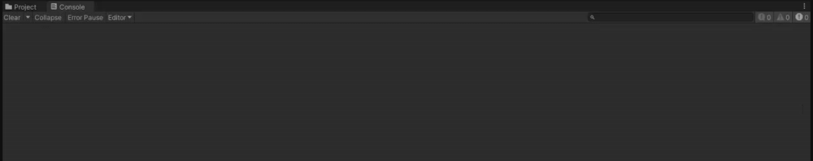
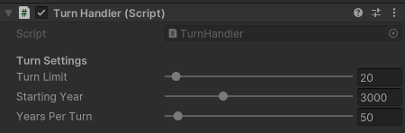

# Week of September 10th, 2023
## Thursday, September 14th, 2023
This marks the first day of my actual work on Nebulous Affairs! Other than tidying up some GitHub things, my main focus was a simple setup of the **turn system**:
1. Backed by a struct, to be shared by any systems needing to interface with turn data
2. Contains fields relating to current turn, turn limit, and some game-dressing (in-game year)
3. Simple editor controls to modify pretty much every field
4. Easily expandable; event system with UnityActions, and room to pack more data

